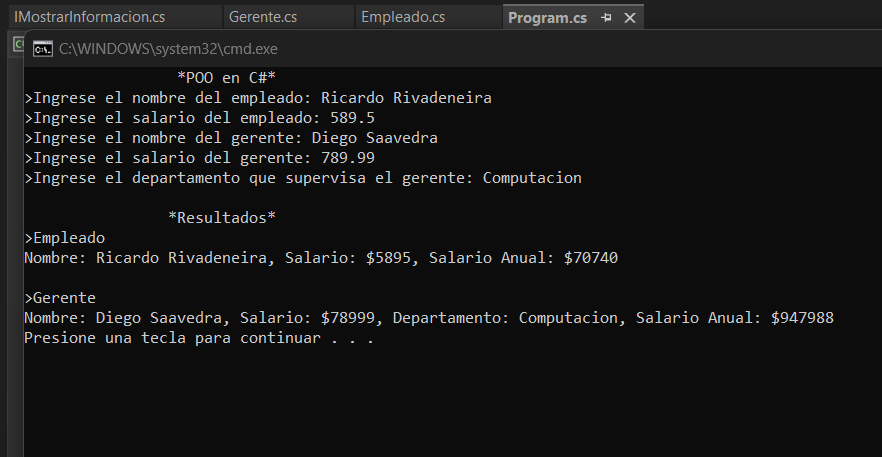

# AplicacionPOO_R
# Aplicación de Gestión de Empleados y Gerentes

Esta aplicación en C# permite al usuario ingresar información sobre un empleado y un gerente, calculando su salario anual y mostrando la información utilizando interfaces y polimorfismo.

## Instrucciones de Uso

1. Ejecutar el programa desde el entorno de desarrollo o terminal.
2. La aplicación solicitará al usuario ingresar la información del empleado y del gerente.
3. Para el empleado:
   - Ingrese el nombre del empleado.
   - Ingrese el salario mensual del empleado.
4. Para el gerente:
   - Ingrese el nombre del gerente.
   - Ingrese el salario mensual del gerente.
   - Ingrese el departamento que el gerente supervisa.
5. La aplicación calculará automáticamente el salario anual para el empleado y mostrará la información de ambos empleados.

## Uso de Herencia

- Se implementa la herencia en la clase `Gerente`, que extiende la clase base `Empleado`. El gerente hereda los atributos y métodos de la clase Empleado, agregando un nuevo atributo para el departamento supervisado.

## Uso de Interfaces y Polimorfismo

- Se define una interfaz `IMostrarInformacion` que contiene un método para mostrar información general.
- Se implementa la interfaz en las clases `Empleado` y `Gerente`, lo que permite mostrar información específica de cada tipo de objeto utilizando polimorfismo.
- El polimorfismo se emplea al invocar el método de la interfaz a través de los objetos de las clases `Empleado` y `Gerente`, permitiendo que el programa muestre la información correspondiente a cada tipo de empleado.

## Requisitos del Sistema

- Se requiere tener instalado un entorno de desarrollo compatible con C# (por ejemplo, Visual Studio).
- Alternativamente, se puede ejecutar el programa desde la línea de comandos utilizando el compilador de C#.

## Ejecución

1. Clona este repositorio o descarga los archivos.
2. Abre el proyecto en tu entorno de desarrollo C# (por ejemplo, Visual Studio).
3. Compila y ejecuta el programa.
4. Sigue las instrucciones en la consola para ingresar la información del empleado y del gerente.

## Tecnologías Utilizadas

- C#
- Visual Studio

## Licencia

Este proyecto está relizado por Ricardo Rivadenria.
